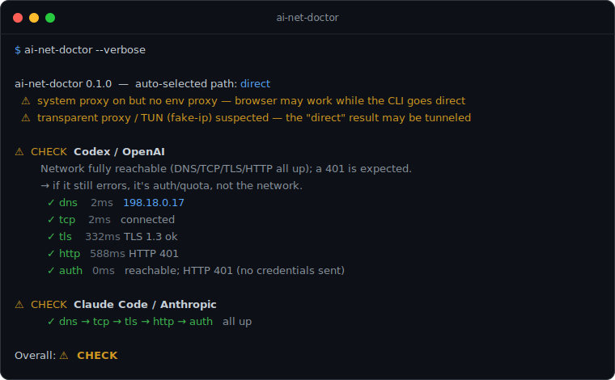

# ai-net-doctor

**Stop guessing why Codex or Claude Code says `stream disconnected`.**
One command tells you whether your network can actually reach **Codex/OpenAI**
and **Claude/Anthropic** — and if not, exactly which layer broke
(DNS · TCP · TLS · HTTP · auth · proxy).

[](https://github.com/wxggzz/ai-net-doctor/actions/workflows/ci.yml)
[](https://github.com/wxggzz/ai-net-doctor/releases)
[](./LICENSE)
[](https://go.dev)

> 中文说明见 [README.zh-CN.md](./README.zh-CN.md)。

<p align="center"></p>

<sub>Static preview — run <code>vhs docs/demo.tape</code> to regenerate an animated <code>docs/demo.gif</code>.</sub>

```text
ai-net-doctor 0.1.0  —  auto-selected path: direct
  ⚠️  system proxy is on but no env proxy — the browser may work while the CLI goes direct
  ⚠️  transparent proxy / TUN (fake-ip) suspected — the "direct" result below may be tunneled

⚠️  CHECK  Codex / OpenAI
        Network fully reachable (DNS/TCP/TLS/HTTP all up); a 401/403 is expected — no credentials sent.
        → If Codex/Claude still errors, it is auth/quota, not the network: check login, API key, subscription.
          ✓ dns    2ms     198.18.0.17
          ✓ tcp    2ms     connected
          ✓ tls    332ms   TLS 1.3 ok
          ✓ http   588ms   HTTP 401
          ✓ auth   0ms     reachable; HTTP 401 (auth not verified — no credentials sent)

Overall: ⚠️ CHECK
```

## Why

When Codex / Claude Code fail with `stream disconnected before completion`,
`error sending request for url`, or a silent timeout, you can't tell whether the
problem is **DNS, the proxy, routing, TLS interception, or just auth/quota**.
`ai-net-doctor` probes **the real path your client takes** (direct, env proxy, or
macOS system proxy), layer by layer, and gives each target an independent
verdict plus the first breakpoint.

### The key ideas

- **Network vs. auth, decided for you.** The probe sends a **credential-less**
  minimal request to the real API endpoint. A well-formed `401` back *proves*
  DNS+TCP+TLS+HTTP all work — so the tool can say "your network is fine, the
  problem is auth/quota" instead of a scary red failure.
- **It tests the path the client really uses.** Most naive checks connect with a
  raw socket (ignoring your proxy) while the client uses the proxy — so they show
  green while the client is broken. This tool probes `direct` / env-proxy /
  system-proxy explicitly and won't silently downgrade when you force one.
- **It catches the blind spots.** Transparent TUN / fake-ip proxies (Clash /
  sing-box / Surge), `NO_PROXY` bypass, and env-vs-system proxy divergence are
  all surfaced instead of quietly producing a misleading "direct" result.
- **Trustworthy by construction.** The CLI computes every conclusion
  (`verdict` / `failed_layer` / `reason_code`); wrappers (skills, click entries)
  only display it. Zero third-party dependencies — Go standard library only.

## Install

**Homebrew** (macOS / Linux):

```bash
brew install wxggzz/tap/ai-net-doctor
```

**One-line script** (macOS / Linux — downloads the release binary):

```bash
curl -fsSL https://raw.githubusercontent.com/wxggzz/ai-net-doctor/main/scripts/install.sh | sh
```

**Go** (1.22+):

```bash
go install github.com/wxggzz/ai-net-doctor/cmd/ai-net-doctor@latest
```

**Prebuilt binaries** for macOS / Linux / Windows are on the
[Releases](https://github.com/wxggzz/ai-net-doctor/releases) page.

**From source**:

```bash
git clone https://github.com/wxggzz/ai-net-doctor
cd ai-net-doctor && go build -o ./bin/ai-net-doctor ./cmd/ai-net-doctor
```

## Usage

```bash
ai-net-doctor                    # default: test both, human-readable report
ai-net-doctor --target codex     # only Codex / OpenAI
ai-net-doctor --target claude    # only Claude Code / Anthropic
ai-net-doctor --verbose          # per-layer waterfall with the first breakpoint
ai-net-doctor --json             # machine-readable, versioned schema
ai-net-doctor --budget 20        # total time budget in seconds (default 15)
ai-net-doctor --direct           # force direct (ignore proxies)
ai-net-doctor --proxy env        # force the env-var proxy (HTTPS_PROXY/...)
ai-net-doctor --proxy system     # force the macOS system proxy (scutil --proxy)
```

Without a forced path, it auto-selects: env proxy if `HTTPS_PROXY` /
`HTTP_PROXY` / `ALL_PROXY` is set, else direct. **A forced proxy path never
silently downgrades** — if you `--proxy env` with no env proxy, that's a `FAIL`
(`ENV_PROXY_NOT_CONFIGURED`), not a fake green.

### Exit codes

| Code | Meaning |
|------|---------|
| `0`  | all targets OK |
| `2`  | at least one CHECK, no FAIL |
| `3`  | at least one FAIL |

> The probe **never sends your API key**, so endpoints answer `401`. That's
> classified as `CHECK` / `AUTH_REQUIRED_REACHABLE` — it proves the network path
> is fully up.

## How it works

For each target, along the resolved path:

```
DNS ─▶ TCP (or PROXY CONNECT) ─▶ TLS ─▶ HTTP ─▶ auth
```

It short-circuits at the first broken layer and marks the rest `skipped`, so you
get the *first* breakpoint, not a wall of errors. Both targets are probed
concurrently under one shared time budget.

## Platform support

| Path | macOS | Linux | Windows |
|------|:-----:|:-----:|:-------:|
| direct | ✅ | ✅ | ✅ |
| env proxy (`HTTPS_PROXY`…) | ✅ | ✅ | ✅ |
| system proxy auto-detect | ✅ (`scutil`) | ⏳ planned | ⏳ planned |

The binary is cross-platform (pure Go). Only *system-proxy auto-detection* is
macOS-only today; on Linux/Windows use `--proxy env` or `--direct`.

## Editor / agent integration

The same CLI backs two thin skills that only call it and translate the JSON —
they never re-derive the verdict. Both ship in this repo under
[`integrations/`](./integrations/):

- **Claude Code**: a `/network-doctor` skill
  ([`integrations/claude-code/`](./integrations/claude-code/network-doctor/)).
- **Codex**: a personal plugin
  ([`integrations/codex/`](./integrations/codex/codex-network-doctor/)).

See [integrations/README.md](./integrations/README.md) for install steps.

## Reason codes (JSON `reason_code`)

**FAIL:** `DNS_RESOLVE_FAILED` · `TCP_CONNECT_TIMEOUT` · `TCP_CONNECT_FAILED` ·
`TLS_HANDSHAKE_FAILED` · `HTTP_UNREACHABLE` · `PROXY_CONNECT_TIMEOUT` ·
`PROXY_CONNECT_FAILED` · `PROXY_AUTH_REQUIRED` · `ENV_PROXY_NOT_CONFIGURED` ·
`SYSTEM_PROXY_NOT_CONFIGURED` · `UNSUPPORTED_BASE_URL_SCHEME`

**OK / CHECK:** `OK` · `AUTH_REQUIRED_REACHABLE`

**Path-level warnings (never change a verdict):** `NO_PROXY_EXCLUDES_TARGET` ·
`ENV_SYSTEM_PROXY_DIVERGED` · `BUDGET_EXCEEDED` · `SYSTEM_PROXY_SET_BUT_ENV_EMPTY` ·
`TRANSPARENT_PROXY_SUSPECTED`

## Security & privacy

- Local-only. No telemetry, no upload.
- The auth probe **sends no credentials**.
- Credentials (`OPENAI_API_KEY` / `ANTHROPIC_API_KEY` / `ANTHROPIC_AUTH_TOKEN`)
  are reported as `present: true/false` only — never their values.
- Proxy `user:pass` is redacted. The full environment is never dumped.

## Roadmap

- Cross-platform system-proxy detection (Linux/Windows)
- `--stream` disconnect probe (reproduce `stream disconnected`)
- Captive-portal and IPv6-blackhole detection
- Homebrew tap

## Contributing

Issues and PRs welcome. Please run `go test ./...`, `go vet ./...`, and
`gofmt -l .` (must be empty) before submitting.

## License

[MIT](./LICENSE)
